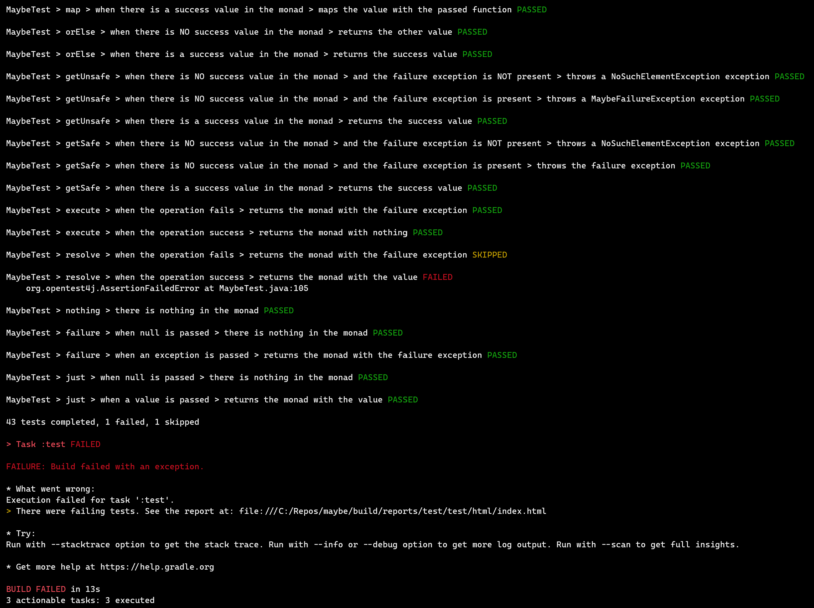
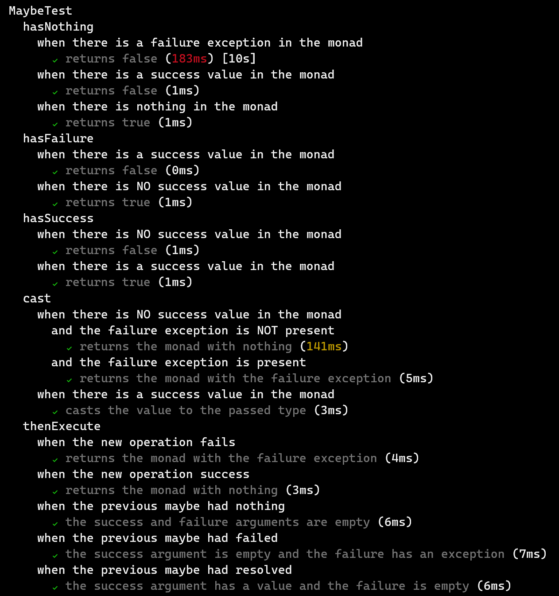
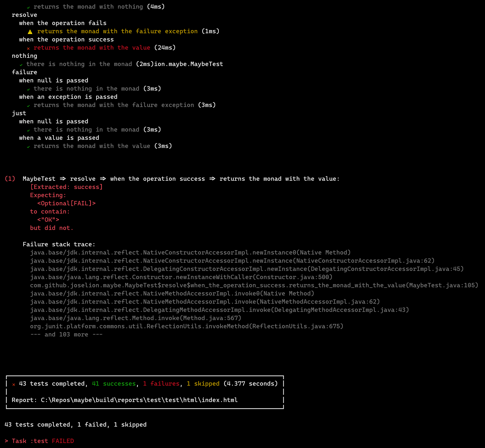

[](https://plugins.gradle.org/plugin/io.github.joselion.pretty-jupiter)
[](https://app.circleci.com/pipelines/github/JoseLion/pretty-jupiter?branch=master)
[](https://codecov.io/gh/JoseLion/pretty-jupiter)

# Pretty Jupiter Plugin

## Why?
JUnit 5 brings to us the [@Nested](https://junit.org/junit5/docs/current/user-guide/#writing-tests-nested) annotation feature, which allows the test writer to group tests with similar conditions (initializations, relationships, etc.), and lets us add some BDD love to our test suites. This works great until we run the test suite with Gradle's `test` task. Even if we change the [testLogging](https://docs.gradle.org/current/dsl/org.gradle.api.tasks.testing.logging.TestLoggingContainer.html) closure on our build script to log more information and events about the tests, we'll end up with some not-very-friendly to read logs.

This plugin intends to solve that by grouping test logs and presenting them in a more readable, understandable and prettier way. Moving failure traces to the end so they could be tackled more easily and finishing with a pretty summary. Durations, their color threshold, and failure traces can be configured using the `prettyJupiter` extension.

## Usage
> **⚠️ BREAKING CHANGES**
>
> Due to changes on GitHub, and by consequence Gradle and Maven, it's no longer allowed to use `com.github` as a valid group ID prefix. That being said, from version v2.0.0 of the plugin the ID is now `io.github.joselion.pretty-jupiter`. If you want to use a version prior to v2.0.0 you can still find it under `com.github.joselion.pretty-jupiter`, but keep in mind that the `io.github` prefixed ID does not have any v1.x.x version available.

**Important:** For better results, make sure your system (or the JVM) uses `UTF-8` encoding. This can be done in many ways, but a simple one could be to add the `JAVA_TOOL_OPTIONS` environment variable. This could be specially helpful for Windows users.
```sh
JAVA_TOOL_OPTIONS="-Dfile.encoding=UTF8"
```

Using the [plugins DSL](https://docs.gradle.org/current/userguide/plugins.html#sec:plugins_block):
<details open>
<summary>Groovy</summary>

```groovy
plugins {
  id 'io.github.joselion.pretty-jupiter' version 'x.x.x'
}
```
</details>

<details>
<summary>Kotlin</summary>

```kotlin
plugins {
  id("io.github.joselion.pretty-jupiter") version "x.x.x"
}
```
</details>

Using [legacy plugin application](https://docs.gradle.org/current/userguide/plugins.html#sec:old_plugin_application):
<details open>
<summary>Groovy</summary>

```groovy
buildscript {
  repositories {
    maven {
      url 'https://plugins.gradle.org/m2/'
    }
  }
  dependencies {
    classpath 'gradle.plugin.io.github.joselion.pretty-jupiter:pretty-jupiter:x.x.x'
  }
}

apply plugin: 'io.github.joselion.pretty-jupiter'
```
</details>

<details>
<summary>Kotlin</summary>

```kotlin
buildscript {
  repositories {
    url = uri("https://plugins.gradle.org/m2/")
  }
  dependencies {
    classpath("gradle.plugin.io.github.joselion.pretty-jupiter:pretty-jupiter:x.x.x")
  }
}

apply(plugin = "io.github.joselion.pretty-jupiter")
```
</details>

## Extension properties
The plugin can be customized adding a `prettyJupiter` closure to your `build.gradle` file and changing the following properties:

| Property                      | Default        | Description |
| ------------------------------|:--------------:| ----------- |
| duration                      | -              | Closure to configure the test durations logged |
| duration.enabled              | `true`         | If `true`, shows each test execution duration |
| duration.threshold            | `75`           | Time threshold in milliseconds. If the test duration is `>=` than this value, it'll be colored <span style="color:red">RED</span>, if it's `>=` than half of this value, it'll be <span style="color:yellow">YELLOW</span>, otherwise it'll be white. |
| duration.customThreshold      | empty map      | Map that contains task name as a key and its custom threshold as a value. When customThreshold is present and contains running task, duration.threshold is overriden|
| failure                       | -              | Closure to configure the test failures logged |
| failure.maxMessageLines       | `15`           | The number of lines of the exception message to display. Note that some exception messages may include some stack trace on it |
| failure.maxTraceLines         | `10`           | The number of lines of the exception stack trace to display |

### Complete example


<details open>
<summary>Groovy</summary>

```groovy
prettyJupiter {
  duration {
    enabled = true
    threshold = 75
    customThreshold = [test : 100, integrationTest : 150]  
  }

  failure {
    maxMessageLines = 15
    maxTraceLines = 10
  }
}
```

</details>

<details>
<summary>Kotlin</summary>

```kotlin
prettyJupiter {
  duration {
    enabled.set(true)
    threshold.set(75)
    customThreshold.put("test", 100)
    customThreshold.put("integrationTest", 10000)
  }

  failure {
    maxMessageLines.set(15)
    maxTraceLines.set(10)
  }
}
```
</details>

## Illustrations

### Before
Adding the following to `build.gradle` file:


<details open>
<summary>Groovy</summary>

```groovy
test {
  useJUnitPlatform()

  testLogging {
    exceptionFormat 'short'
    events 'started', 'skipped', 'failed'
  }
}
```
</details>

<details>
<summary>Kotlin</summary>

```kotlin
import org.gradle.api.tasks.testing.logging.TestExceptionFormat.SHORT
import org.gradle.api.tasks.testing.logging.TestLogEvent.FAILED
import org.gradle.api.tasks.testing.logging.TestLogEvent.SKIPPED
import org.gradle.api.tasks.testing.logging.TestLogEvent.STARTED

tasks {
  test {
    useJUnitPlatform()
    testLogging {
      exceptionFormat = SHORT
      events = setOf(STARTED, SKIPPED, FAILED)
    }
  }
}
```
</details>



### With `pretty-jupiter` plugin applied
We only need Junit 5 configuration in `build.gradle(.kts)` file:


<details open>
<summary>Groovy</summary>

```groovy
test {
  useJUnitPlatform()
}
```
</details>

<details>
<summary>Kotlin</summary>

```kotlin
tasks {
  test {
    useJUnitPlatform()
  }
}
```
</details>




## Want to add further customizations?
Please create an [issue](https://github.com/JoseLion/pretty-jupiter/issues/new) describing your request, feature or bug. I'll try to look into it as soon as possible 🙂

## Contribution
Contributions are very welcome! To do so, please fork this repository and open a Pull Request to the `master` branch.

To debug this plugin with help of another gradle project add to external project:

<details open>
<summary>settings.gradle</summary>

```groovy
pluginManagement {
  includeBuild '../pretty-jupiter/'
}
```
</details>

<details>
<summary>settings.gradle.kts</summary>

```kotlin
pluginManagement {
  includeBuild("../pretty-jupiter/")
}

```
</details>

Then run your project from command line:
```shell
./gradlew clean test -Dorg.gradle.debug=true --no-daemon
```
And connect with debugger on port 5005.

## License

[Apache License 2.0](LICENSE)
